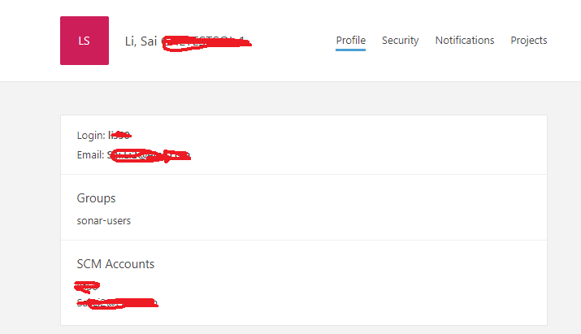

We use Bitnami Sonarqube OVA and deployed in vCenter.

Configure file path: /home/bitnami/apps/sonarqube/sonarqube/conf/sonar.properties

```

# LDAP configuration
# General Configuration
sonar.security.realm=LDAP
ldap.url=LDAP_URL	
ldap.bindDn=service_account_name
ldap.bindPassword=service_account_password
# User Configuration
ldap.user.baseDn=dc=corp,dc=company_name,dc=com
ldap.user.request=(sAMAccountName={login})
```

then restart Sonarqube: sudo /opt/bitnami/ctlscript.sh restart sonarqube

after Sonarqube start, login in.