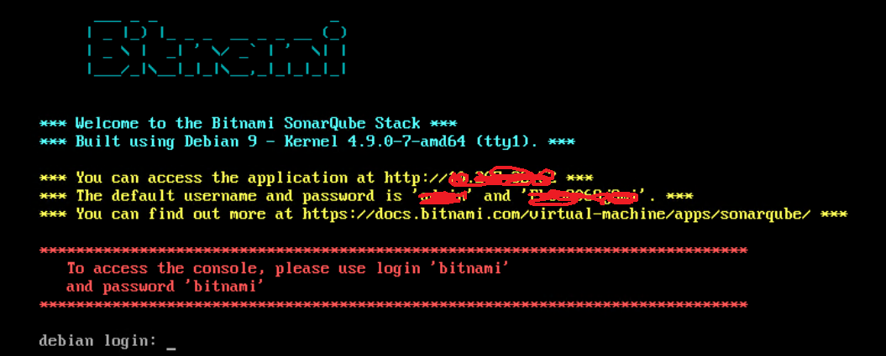

## Steps:

1. Download Bitnami SonarQube and import to vcenter.

   https://bitnami.com/stack/sonarqube/virtual-machine

2. Power on VM.

   First time login in will ask you to change default password.

3. Since we don't enable DHCP in our site, we will use static ip address for this vm.

   

​       modify /etc/network/interfaces file and then restart network.

```
# The loopback network interface
auto lo
iface lo inet loopback

# The primary network interface
auto ens32
iface ens32 inet static
address x.x.x.x
netmask x.x.x.x
gateway x.x.x.x
dns-nameservers x.x.x.x

```

```
sudo service networking restart
```

Note: Last time restart network failed(command not found) is due to /etc/network/interfaces.d is not compatible to /etc/network/interfaces, I just delete /etc/network/interfaces.d and restart network successfully.


4. Restart VM and view page in browser.

   

​       Above console output will show Sonarqube credentials.


